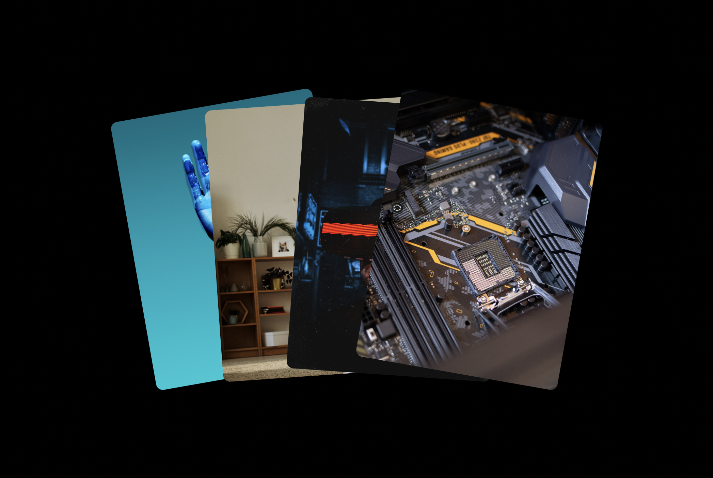

# Stack Effect

In this example we stack 4 cards to create a stack-unstack effect using html/css.  
This can be a cool effect to use for cases where you want user to hover to see multiple features or use cases of your product.

Before:

On Hover:

## Effect Detail

There are 3 main components to this effect:  

1. Card position before hover
2. Card position on hover
3. Transition

### Before Hover

We have used absolute position so we can actually stack our cards on the screen. After that we have used transform to slightly manipulate the position and rotation of these cards.

### On Hover

When the user hover the card group, we transform the rotation and translation of the individual cards once again to unstack them.

### Transition

We make the transition time to be 0.5s so the transform change from before and after looks smooth, we could've further experimented with bezier curves to add more character to the transition.
